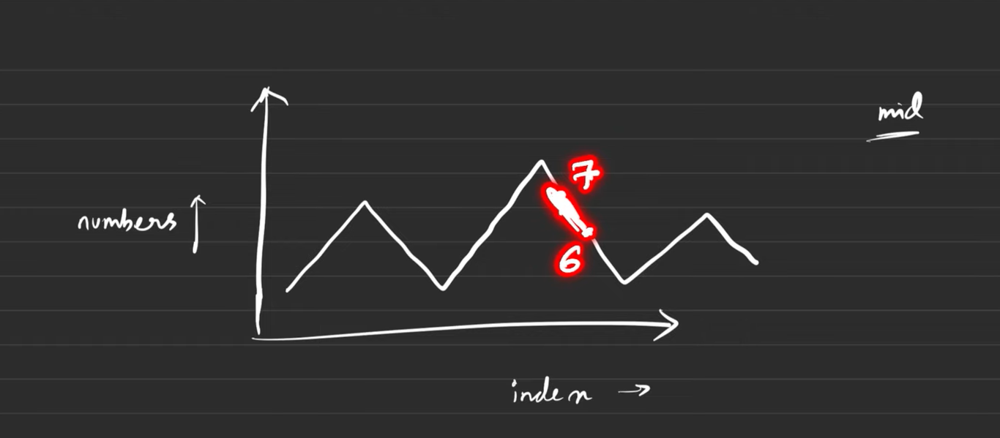

## Find a Peak Element II

**LeetCode ID:** 1901  
**Difficulty:** Medium  

---

### Problem Statement
Given a 2D grid of integers where adjacent cells are different, find a peak element and return its position. A peak element is greater than all of its adjacent neighbors (up, down, left, right).

---

### Approach
- Apply **binary search on columns**.
- For a chosen column, find the row index of the maximum element.
- Compare this element with its left and right neighbors to decide the search direction.

---



---

### Code (C++)
```cpp
class Solution {
public:
    vector<int> findPeakGrid(vector<vector<int>>& mat) {
        int rows = mat.size();
        int cols = mat[0].size();
        int left = 0, right = cols - 1;

        while (left <= right) {
            int mid = left + (right - left) / 2;

            int maxRow = 0;
            for (int i = 0; i < rows; i++) {
                if (mat[i][mid] > mat[maxRow][mid]) {
                    maxRow = i;
                }
            }

            int leftVal = (mid - 1 >= 0) ? mat[maxRow][mid - 1] : -1;
            int rightVal = (mid + 1 < cols) ? mat[maxRow][mid + 1] : -1;

            if (mat[maxRow][mid] > leftVal && mat[maxRow][mid] > rightVal) {
                return {maxRow, mid};
            } else if (rightVal > mat[maxRow][mid]) {
                left = mid + 1;
            } else {
                right = mid - 1;
            }
        }

        return {-1, -1};
    }
};
```

### Time Complexity

- Time: O(n log m)
(n = rows, m = columns)

- Space: O(1)

### Key Insight

By always moving toward the direction of a larger neighbor column, we guarantee reaching a peak, enabling binary search in one dimension.


