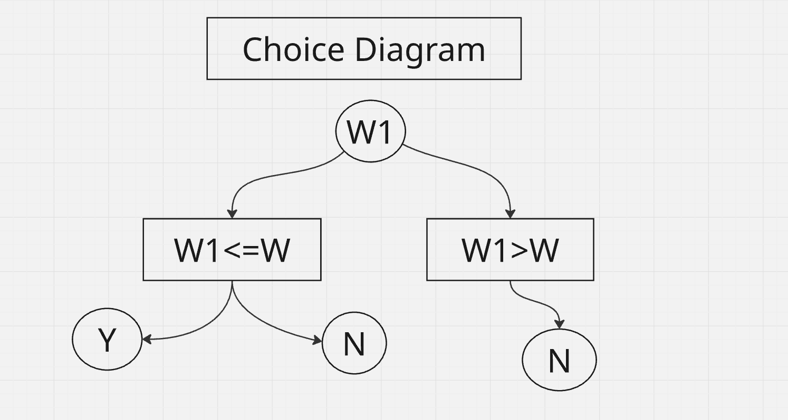

## 01 Knapsack Recursive

- Base Condition -> Think of the smallest valid input
- Choice Diagram



---
- Recursive Function
    > Func(input) -> Func(smaller input)

Har baar smaller input ke liye function call karna hoga or else function kabhi khatam nai hoga

---
## Code

```cpp 
int knapsack(int wt[], int val[], int W, int n){
    // Base Condition
    if(n==0 || W==0) return 0;

    // Choice Diagram
    if(wt[n-1]<=W){
        return max(val[n-1]+knapsack(wt,val,W-wt[n-1],n-1),knapsack(wt,val,W,n-1));
    }
    else if(wt[n-1]>W){
        return knapsack(wt,val,W,n-1);
    }
}
```